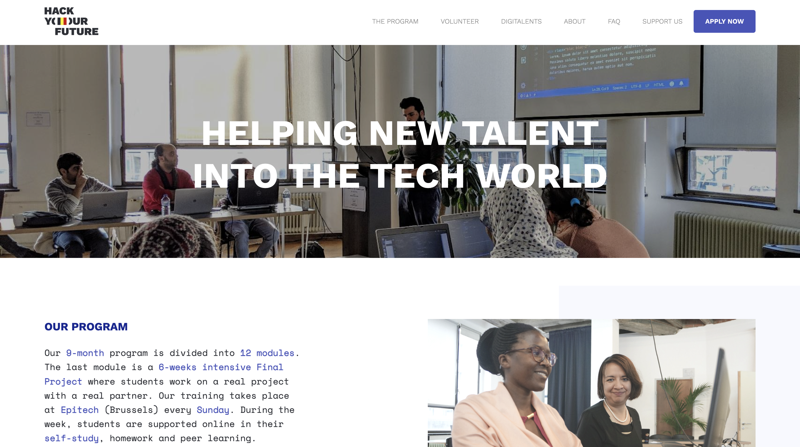

# Recreating Hack Your Future Website

> A website for students helping to learn coding and the volunteers to
> contribute their knowledge by helping the students.

## Table of contents

- [Recreating Hack Your Future Website](#recreating-hack-your-future-website)
  - [Table of contents](#table-of-contents)
  - [✅ General info](#-general-info)
  - [✅ Screenshots](#-screenshots)
  - [✅ Technologies](#-technologies)
  - [✅ Code Examples](#-code-examples)
  - [✅ Features](#-features)
  - [✅ Status](#-status)
  - [✅ Inspiration](#-inspiration)
  - [✅ Collaborators](#-collaborators)
  - [✅ Coaches](#-coaches)
  - [✅ Instructions for use](#-instructions-for-use)
  - [Code Quality Checks](#code-quality-checks)
  - [Continuous Integration (CI)](#continuous-integration-ci)
  - [Repo Setup](#repo-setup)

## ✅ General info

> This project's main goal is planning and collaborating as a team for the
> reconstruction of the Hack Your Future website. We are aiming to learn how to
> recreate the website with our own code and to create a responsive website.

## ✅ Screenshots



## ✅ Technologies

- HTML 5
- CSS 3
- VS Code

## ✅ Code Examples

```<!DOCTYPE html>
<html lang="en">
  <head>
    <meta charset="UTF-8" />
    <link rel="icon" type="image/svg+xml" href="./client/assets/favicon.ico" />
    <meta name="viewport" content="width=device-width, initial-scale=1.0" />
    <title>project!</title>

    <link href="./styles/index.css" rel="stylesheet" />
  </head>
  <body></body>
</html>

```

## ✅ Features

- Responsive Website
- CSS Grid
- Flexbox

## ✅ Status

Project is: _in progress_

## ✅ Inspiration

Project by hackyourfuture.be

## ✅ Collaborators

- [Dnyandeo33](https://github.com/Dnyandeo33)
- [Haneefa-Shaik](https://github.com/Haneefa-Shaik)
- [minjupgeorge](https://github.com/minjupgeorge)
- [kiishiakande](https://github.com/kiishiakande)
- [EliasMlopez99](https://github.com/EliasMlopez99)
- [alexanderism55](https://github.com/alexanderism55)

## ✅ Coaches

- [bermarte](https://github.com/bermarte)
- [Tamer A.](https://github.com/talmurshidi)

## ✅ Instructions for use

<details>
  <summary>Getting Started</summary>

<!-- a guide to using this repository -->

1. `git clone git@github.com:HackYourFutureBelgium/template-markdown.git`
2. `cd template-markdown`
3. `npm install`

## Code Quality Checks

- `npm run format`: Makes sure all the code in this repository is well-formatted
  (looks good).
- `npm run lint:ls`: Checks to make sure all folder and file names match the
  repository conventions.
- `npm run lint:md`: Will lint all of the Markdown files in this repository.
- `npm run lint:css`: Will lint all of the CSS files in this repository.
- `npm run validate:html`: Validates all HTML files in your project.
- `npm run spell-check`: Goes through all the files in this repository looking
  for words it doesn't recognize. Just because it says something is a mistake
  doesn't mean it is! It doesn't know every word in the world. You can add new
  correct words to the [./.cspell.json](./.cspell.json) file so they won't cause
  an error.
- `npm run accessibility -- ./path/to/file.html`: Runs an accessibility analysis
  on all HTML files in the given path and writes the report to
  `/accessibility_report`

## Continuous Integration (CI)

When you open a PR to `main`/`master` in your repository, GitHub will
automatically do a linting check on the code in this repository, you can see
this in the[./.github/workflows/lint.yml](./.github/workflows/lint.yml) file.

If the linting fails, you will not be able to merge the PR. You can double check
that your code will pass before pushing by running the code quality scripts
locally.

## Repo Setup

- Give each member _write_ access to the repo (if it's a group project)
- Turn on GitHub Pages and put a link to your website in the repo's description
- Turn on GitHub Actions
- in the _Branches_ section of your repo's settings make sure:
  - The repository
    [requires a review](https://github.blog/2018-03-23-require-multiple-reviewers/)
    before pull requests can be merged.
  - The `master`/`main` branch must "_Require status checks to pass before
    merging_"
  - The `master`/`main` branch must "_Require require branches to be up to date
    before merging_"

</details>
